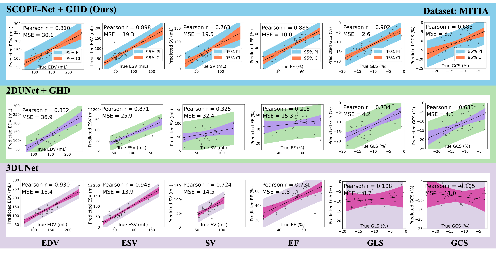

# 🫀 FeEcho4D Dataset

**FeEcho4D is the first public dataset for 4D radial fetal echocardiography.**
-	🧪 52 subjects, 1,845 annotated 3D volumes, 3M+ annotated 2D slices
-	🌀 37 radial views per volume, full 4D coverage
-	🎯 Manual annotation across the full cardiac cycle, including both ED and ES frames
- ✅ Clinical metrics: EF, GLS, GCS, EDV, ESV, SV

**📎 Access the dataset and tools:**
👉 [**FeEcho4D**](https://feecho4d.github.io/Website/)

---

## ⚕️ Clinical Evaluation & Results

<p align="center">
  
</p>

**🔍 Experiment:** We compare point clouds between predicted and ground-truth meshes in both short-axis views and 3D perspectives on FeEcho4D and MITEA, using SCOPE-Net vs. UNet.
**✅ Summary:** SCOPE-Net shows superior spatial alignment, especially at the apex and lateral wall, indicating better segmentation consistency and reconstruction quality.

<p align="center">
  
</p>

**🔍 Experiment:** On the MITEA dataset, we evaluate clinical metrics (EF, GLS) predicted by SCOPE-Net+GHD, UNet+GHD, and 3D UNet, reporting Pearson r, MSE, and 95% confidence intervals.
**✅ Summary:** Our method achieves the highest accuracy and lowest variance, demonstrating strong potential for reliable clinical use in fetal cardiac analysis.

---
## 📈 Citation

If you find this work helpful, please cite:

```bibtex
@article{hasan2025feecho4d,
  title={4D Reconstruction of Fetal Left Ventricle from Echocardiography via 2.5D Radial Segmentation and Graph-Fourier Reconstruction},
  author={XXX},
  journal={XXX},
  volume={XXX},
  pages={XXX},
  year={2025},
  doi={XXX}
}
```
---
## 🙏 Acknowledgements

- 👏We thank all co-authors for their contributions to this work, particularly in model development, dataset construction, and clinical validation. 
- 👏 Special thanks to Kepler University Hospital for their support in data acquisition and expert annotations.
- 👏And to Imperial College London and Dalian University of Technology for providing research infrastructure and technical guidance.
-  [[Wecome to Qifeng's Github]](https://github.com/QifengWang0702) [[Wecome to Haziq's Github]](https://github.com/haziqshahard) [[Wecome to Yihao's Github]](https://github.com/Luo-Yihao)
